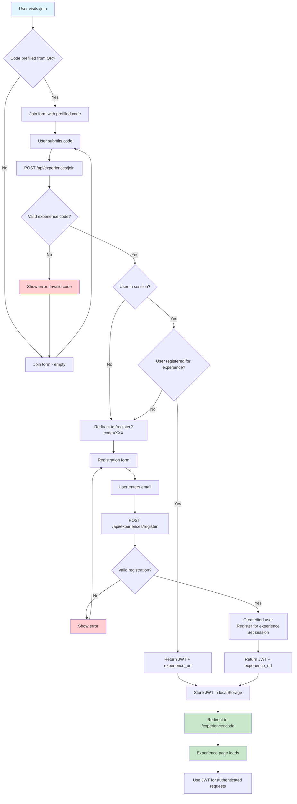

# User Registration

```mermaid
flowchart TD
    A[User visits /join] --> B{Code prefilled from QR?}
    B -->|Yes| C[Join form with prefilled code]
    B -->|No| D[Join form - empty]

    C --> E[User submits code]
    D --> E

    E --> F[POST /api/experiences/join]
    F --> G{Valid experience code?}

    G -->|No| H[Show error: Invalid code]
    H --> D

    G -->|Yes| I{User in session?}
    I -->|No| J[Redirect to /register?code=XXX]
    I -->|Yes| K{User registered for experience?}

    K -->|No| J
    K -->|Yes| L[Return JWT + experience_url]

    J --> M[Registration form]
    M --> N[User enters email]
    N --> O[POST /api/experiences/register]

    O --> P{Valid registration?}
    P -->|No| Q[Show error]
    Q --> M

    P -->|Yes| R[Create/find user<br/>Register for experience<br/>Set session]
    R --> S[Return JWT + experience_url]

    L --> T[Store JWT in localStorage]
    S --> T
    T --> U[Redirect to /experience/:code]

    U --> V[Experience page loads]
    V --> W[Use JWT for authenticated requests]

    style A fill:#e1f5fe
    style U fill:#c8e6c9
    style V fill:#c8e6c9
    style H fill:#ffcdd2
    style Q fill:#ffcdd2
```
